# DNP-ConFormer: Diverse Normal Prototypes-Guided Contrastive Reconstruction for Medical Anomaly Detection

[](https://opensource.org/licenses/MIT)
[](https://conferences.miccai.org/2026/)

## News

- **[2026/06]** DNP-ConFormer has been **provisionally accepted to MICCAI 2026**.

**DNP-ConFormer** is a unified medical anomaly detection framework for domain-adaptive contrastive reconstruction. It combines a trainable student encoder, a momentum teacher encoder, Diverse Normal Prototypes (DNPs), and a Diversity-Aware Alignment loss to improve anomaly detection and localization under medical domain shifts.

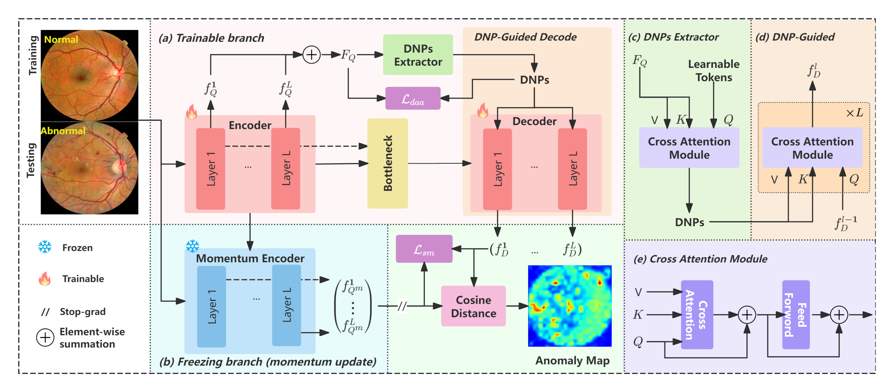

## Highlights

- **Domain-adaptive reconstruction**: Replaces a purely frozen-teacher setup with an asymmetric student-teacher design and a momentum-updated target encoder.
- **Diverse Normal Prototypes**: Extracts multiple normal prototypes from encoder features to represent different modes of normality.
- **DNP-guided decoding**: Injects prototypes into the decoder through cross-attention to guide feature reconstruction.
- **Diversity-Aware Alignment**: Reduces prototype collapse by encouraging balanced feature-to-prototype assignments.
- **Cross-modality robustness**: Evaluated on APTOS2019, OCT2017, ISIC2018, and an in-house BrainMRI dataset.

## Method

DNP-ConFormer consists of four main components.

### 1. Trainable Student Branch

Given an input image, the student encoder extracts multi-layer ViT features and aggregates them into a unified representation. Unlike reverse distillation methods that keep the teacher encoder fixed, DNP-ConFormer allows the student encoder to adapt to medical-domain visual patterns.

### 2. Momentum Teacher Branch

A teacher encoder is updated by exponential moving average (EMA) from the student encoder. This slowly evolving target branch provides stable reference features while preserving useful pretrained knowledge.

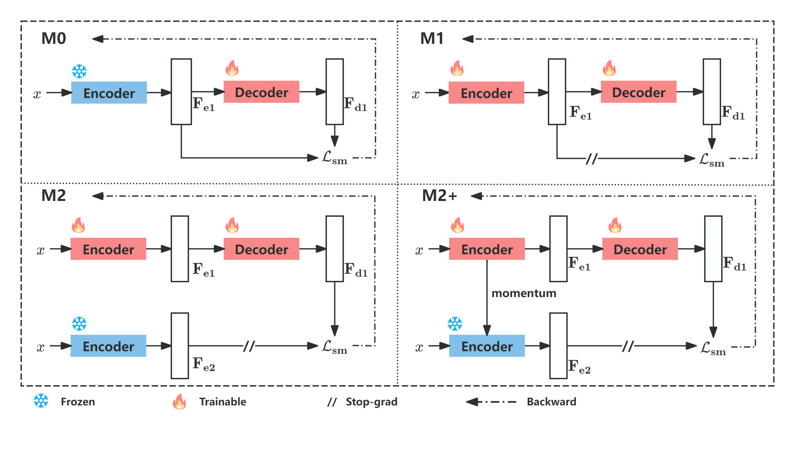

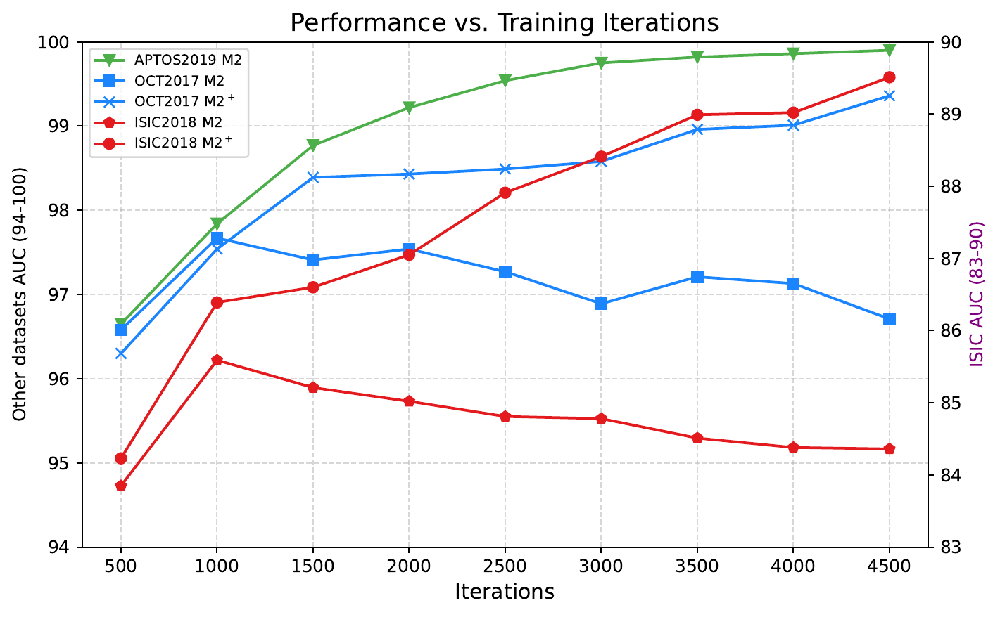

### 3. Diverse Normal Prototype Extraction

DNP-ConFormer introduces learnable prototype tokens and uses cross-attention to discover Diverse Normal Prototypes from normal feature distributions. These prototypes capture different semantic modes of normal medical appearance.

The paper observes that INP-style coherence objectives may suffer from prototype collapse in low-contrast medical images. DNP-ConFormer addresses this with Diversity-Aware Alignment.

| INP-Former | DNP-ConFormer |
| --- | --- |
| 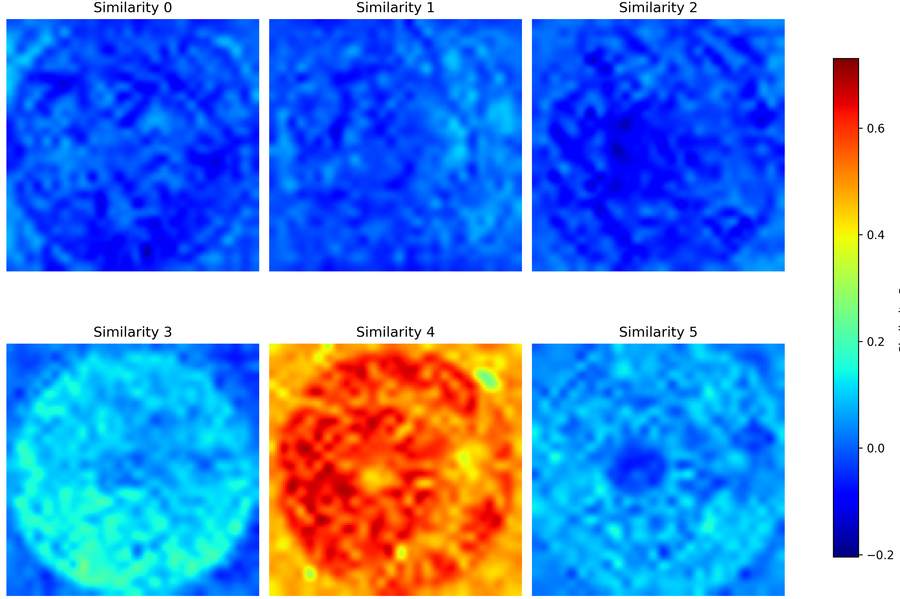 | 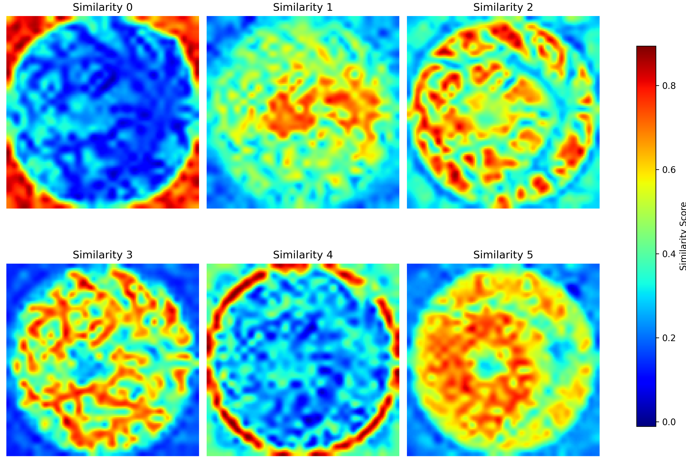 |

### 4. DNP-Guided Contrastive Reconstruction

The bottleneck representation is decoded with prototype guidance. Training optimizes a soft-mining contrastive reconstruction loss together with the Diversity-Aware Alignment loss:

```text
L_total = L_sm^{M2+} + lambda * L_daa
```

This objective improves representation adaptation while keeping prototype assignments balanced and discriminative.

## Results

### Public Benchmarks

DNP-ConFormer is evaluated on three public benchmarks. All results are averaged over five independent runs.

| Dataset | AUC | F1 | ACC |
| --- | ---: | ---: | ---: |
| APTOS2019 | **97.92** | **95.69** | **93.91** |
| OCT2017 | **99.83** | **99.13** | **98.70** |
| ISIC2018 | **91.73** | **82.61** | **87.05** |

### BrainMRI Clinical Dataset

| Level | AUC | AP | F1 | ACC / AUPRO |
| --- | ---: | ---: | ---: | ---: |
| Image-level | **92.52** | - | **87.10** | **85.39 ACC** |
| Pixel-level | **98.53** | **46.03** | **51.10** | **89.27 AUPRO** |

### Qualitative Visualization

DNP-ConFormer generates focused anomaly maps that align with pathological regions while suppressing background noise.

| APTOS2019 | OCT2017 | ISIC2018 |
| --- | --- | --- |
| 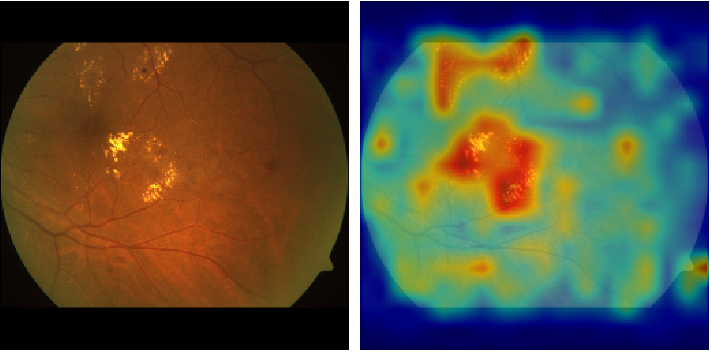 | 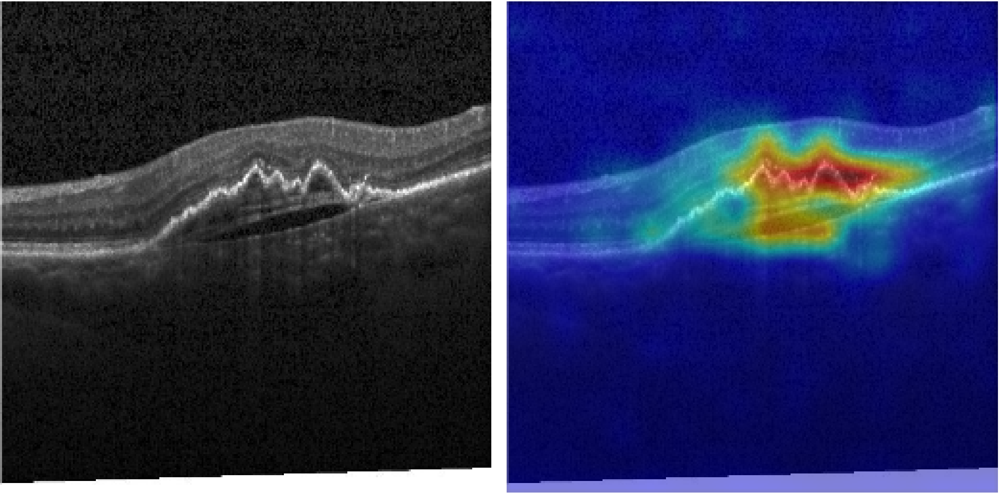 | 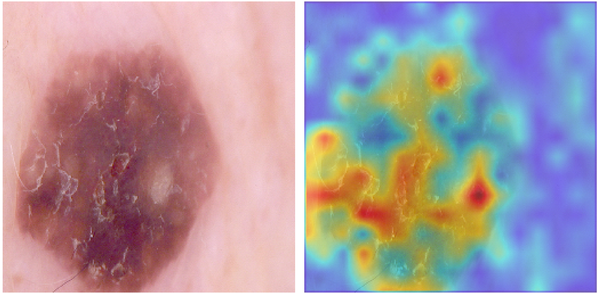 |

| BrainMRI Example 1 | BrainMRI Example 2 | BrainMRI Example 3 |
| --- | --- | --- |
| 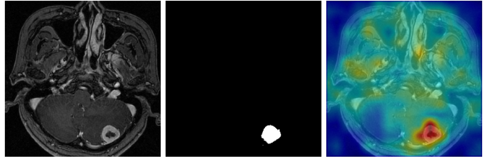 | 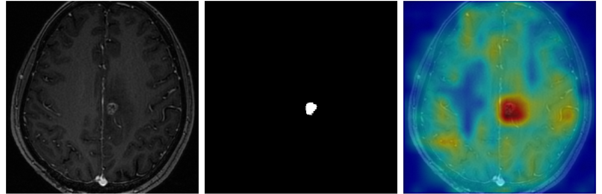 | 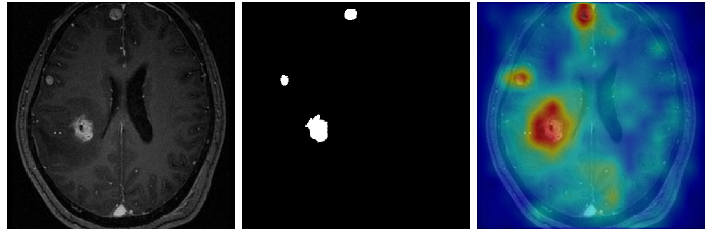 |

## Project Structure

```text
DNP-ConFormer/
|-- main.py                   # Training and testing entry point
|-- dataset.py                # Dataset loader and transforms
|-- aug_funcs.py              # Image augmentation utilities
|-- utils.py                  # Metrics, logging, scheduler, and evaluation
|-- inference_onnx.py         # ONNX inference utility
|-- requirements.txt          # Python dependencies
|-- README.md                 # Project documentation
|-- LICENSE                   # MIT License
|-- assets/
|   `-- fig/                  # Figures from the MICCAI paper
|-- beit/                     # BEiT backbone implementation
|-- dinov1/                   # DINOv1 backbone implementation
|-- dinov2/                   # DINOv2 backbone and utilities
|-- flops_profiler/           # FLOPs and parameter profiling tools
|-- models/
|   |-- DNP_ConFormer.py      # INP_Former / DNP-ConFormer architecture
|   |-- vit_encoder.py        # Backbone loading utilities
|   `-- vision_transformer.py # MLP, aggregation, and prototype decoder blocks
|-- optimizers/
|   `-- StableAdamW.py        # StableAdamW optimizer
|-- prepare_dataset/
|   |-- prepare_aptos.py      # APTOS2019 preprocessing
|   |-- prepare_br35h.py      # BrainMRI / Br35H preprocessing
|   `-- prepare_isic2018.py   # ISIC2018 preprocessing
`-- dataset/                  # Place prepared datasets here
```

## Installation

### Prerequisites

- Python 3.8+
- CUDA-capable GPU is recommended
- PyTorch matching your local CUDA driver

### Install Dependencies

```bash
git clone git@github.com:liluhu0/DNP-ConFormer.git
cd DNP-ConFormer
pip install -r requirements.txt
```

The released requirement file uses PyTorch with CUDA 11.8. If your CUDA version differs, install the matching PyTorch and torchvision packages first, then install the remaining dependencies.

## Usage

### 1. Prepare Data

The training protocol follows unsupervised anomaly detection: train on normal images only and test on mixed normal / abnormal cases.

Expected folder structure:

```text
dataset/APTOS2019/
|-- train/
|   `-- NORMAL/
|       `-- image files
`-- test/
    |-- NORMAL/
    |   `-- image files
    `-- ABNORMAL/
        `-- image files
```

Dataset preparation scripts are provided:

```bash
python prepare_dataset/prepare_aptos.py
python prepare_dataset/prepare_br35h.py
python prepare_dataset/prepare_isic2018.py
```

### 2. Configure Parameters

Core arguments are defined in `main.py`.

```bash
python main.py \
  --dataset APTOS2019 \
  --data_path ./dataset/APTOS2019 \
  --encoder dinov2reg_vit_small_14 \
  --input_size 224 \
  --INP_num 6 \
  --batch_size 32 \
  --lr 1e-4 \
  --encoder_lr 1e-5 \
  --INP_loss_weight 0.2 \
  --ema_contrast True \
  --ema_decay 0.999 \
  --phase train
```

Implementation details from the paper:

- Backbone: ViT-Small/14 with DINOv2-R weights.
- Optimizer: StableAdamW.
- Batch size: 32.
- Decoder / bottleneck / DNP extractor learning rate: `1e-4`.
- Encoder learning rate: `1e-5`.
- DNP number: `M = 6`.
- Momentum coefficient: `beta = 0.999`.
- DAA loss weight: `lambda = 0.2` (`--INP_loss_weight 0.2` in the released code).
- Training iterations: 8k for OCT2017, 5k for APTOS2019 and BrainMRI, 4k for ISIC2018.

### 3. Train

```bash
python main.py --phase train --data_path ./dataset/APTOS2019 --dataset APTOS2019 --total_iters 5000 --INP_loss_weight 0.2 --ema_decay 0.999
```

### 4. Test

```bash
python main.py --phase test --data_path ./dataset/APTOS2019 --dataset APTOS2019
```

### 5. Output

Outputs are saved under `saved_results/`, including model checkpoints, EMA encoder checkpoints, logs, image-level metrics, and anomaly-map visualizations when test-time saving is enabled.

## Citation

If you find this work useful, please cite:

```bibtex
@inproceedings{li2026dnpconformer,
  title={Diverse Normal Prototypes-Guided Contrastive Reconstruction for Medical Anomaly Detection},
  author={Li, Luhu and Liu, Bin and Lin, Bowen and Shen, Zihan and Wang, Chengwei and Fu, Shujun},
  booktitle={International Conference on Medical Image Computing and Computer-Assisted Intervention (MICCAI)},
  year={2026}
}
```

## License

This project is released under the [MIT License](LICENSE).

## Acknowledgments

This work was supported in part by the National Natural Science Foundation of China (NSFC) and the Shandong Provincial Natural Science Foundation. We also acknowledge the open-source DINO, DINOv2, BEiT, [Dinomly](https://github.com/guojiajeremy/Dinomaly) communities.
